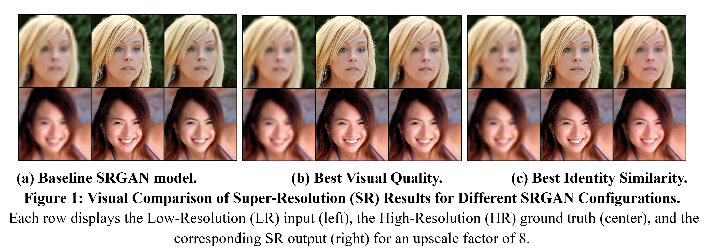

# Identity-Preserving Super-Resolution of Human Faces using GANs

**Author:** Seunghwan Hong

## Abstract

Image Super-Resolution (SR) involves generating a high-resolution (HR) image from a low-resolution (LR) input. This is crucial in fields like medical imaging, security monitoring, and facial recognition. While modern deep learning techniques (CNNs, GANs) have improved SR, traditional metrics (PSNR, SSIM) don't always reflect human perceptual quality. Furthermore, SR models often struggle to preserve important semantic features, especially facial identity.

This project introduces a GAN-based SR approach specifically for facial images. By integrating an identity-preserving loss function that leverages face embeddings, the proposed method aims to significantly improve identity retention and visual realism. The goal is to produce SR images that are both visually convincing and semantically accurate, making them suitable for identity-sensitive applications.

## Introduction: Problem Statement and Motivation

The core challenge in Super-Resolution is its ill-posed nature: a single LR image can correspond to many HR versions. Traditional methods using pixel-wise losses (like MSE) often produce overly smooth or blurry results. GANs offer an alternative by learning to generate realistic images that can fool a discriminator, leading to sharper, more perceptually convincing details.

However, even GAN-based SR models like SRGAN can struggle to consistently preserve crucial semantic attributes, particularly in facial images. Subtle changes to features defining an individual's identity (e.g., eye contours, nose structure) can lead to identity mismatches, reducing trust in applications like biometrics or forensic analysis. This project aims to address this limitation by developing an SR framework that prioritizes both visual quality and the preservation of facial identity.

## Background and Prior Related Work

Deep learning has significantly advanced image SR. Key developments include SRCNN, VDSR, SRGAN, and ESRGAN, which have introduced perceptual and adversarial losses. SRGAN, for instance, uses VGG-based perceptual loss and an adversarial discriminator. However, it doesn't inherently focus on domain-specific constraints like facial identity.

This project adapts the SRGAN architecture by incorporating an identity-specific loss derived from pre-trained face recognition models (e.g., VGGFace2). This aims to ensure that reconstructed images maintain the subject's identity, a crucial aspect often overlooked by general SR methods.

## Major Objectives

1.  **Develop an SR model for facial images** that enhances visual clarity while accurately preserving identity.
2.  **Modify the SRGAN model** by integrating identity-focused loss functions using pre-trained facial embedding models.
3.  **Train the model** using the CelebA-HQ dataset, focusing on consistent facial alignment and expressions.
4.  **Evaluate the model's performance** using traditional metrics (PSNR, SSIM) and identity-specific metrics (cosine similarity of facial embeddings).
5.  **Perform an ablation study** to demonstrate the impact of the identity loss component.

## General Approach and Methods

### Baseline SRGAN Architecture
* **Generator:** Uses an initial convolution, PReLU, five residual blocks for structural detail and stable training, a skip connection, two upsampling blocks (using PixelShuffle/sub-pixel convolution), and a final Tanh activation to normalize output pixels to [0, 1].
* **Discriminator:** A standard CNN with eight convolutional layers for feature extraction and downsampling, followed by adaptive average pooling and two final convolution layers (acting like fully connected layers) with a sigmoid output to classify images as real or generated.

### Baseline Loss Functions
The original SRGAN uses:
$L_{total} = L_{pixel} + 0.006 \cdot L_{content} + 0.001 \cdot L_{GAN}$
Where:
* $L_{pixel}$: Ensures numerical closeness (e.g., MSE).
* $L_{content}$: VGG-based perceptual loss for visual structures.
* $L_{GAN}$: Adversarial loss to encourage realistic textures.

### Proposed Modification: Identity Loss Integration
The key modification is adding an identity loss term:
$L_{total} = L_{pixel} + \alpha \cdot L_{content} + \beta \cdot L_{GAN} + \gamma \cdot L_{identity}$
Where:
* $L_{identity}$: L2 distance (MSE) between face embeddings from a pre-trained InceptionResNetV1 (trained on VGGFace2) model for the generated SR and ground truth HR images. This captures identity-specific features.
* $\alpha, \beta, \gamma$: Weighting coefficients.

### Dataset and Preprocessing
* **Dataset:** CelebA-HQ (2000 training, 100 testing images).
* **Preprocessing:** HR $256 \times 256$ images were center-cropped to $128 \times 128$ due to GPU memory constraints.
* **Training:** Batch size 32, 100 epochs, Adam optimizer (learning rate = 0.0001).
* **Downscale Factor:** 8x. This significant downscaling makes identity preservation more challenging and thus demonstrates the effectiveness of the proposed method.

### Evaluation Metrics
* **PSNR (Y-channel):** On luminance channel, better reflecting human sensitivity.
* **SSIM:** Measures structural similarity.
* **Cosine Similarity:** Between SR and HR face embeddings to directly evaluate identity preservation.

## Results Summary

The project explored different loss weightings:
1.  **Baseline SRGAN:**
    * PSNR-Y: 26.87 dB
    * SSIM: 0.764
    * Cosine Similarity: 0.8404
    * Observation: Decent sharpness but often failed to reconstruct identity-defining details accurately.

2.  **Modified SRGAN - Best Visual Quality** ($L_{content}$ weight: 0.006, $L_{identity}$ weight: 0.006):
    * PSNR-Y: 27.07 dB
    * SSIM: 0.771
    * Cosine Similarity: 0.8406
    * Observation: Smoothest textures, clearer features, fewest artifacts. Highest PSNR/SSIM.

3.  **Modified SRGAN - Best Identity Similarity** ($L_{content}$ weight: 0.005, $L_{identity}$ weight: 0.6):
    * PSNR-Y: 26.75 dB
    * SSIM: 0.759
    * Cosine Similarity: 0.8630
    * Observation: Superior identity preservation (e.g., reconstructing double eyelids), but slightly lower PSNR/SSIM and minor texture artifacts.

### Key Takeaways
* Incorporating an identity-preserving loss significantly improves facial feature preservation.
* There's often a trade-off between identity consistency (cosine similarity) and traditional pixel-based metrics (PSNR, SSIM).
* Loss weight tuning is critical for balancing visual quality and identity fidelity.

## Visual Results Comparison

The following image (Figure 1) shows a visual comparison of the Low-Resolution (LR) input, the High-Resolution (HR) ground truth, and the Super-Resolved (SR) output for different model configurations.



## Code Structure

* `data_utils.py`: Contains utility functions and PyTorch `Dataset` classes for loading and transforming image data.
* `model.py`: Defines the Generator and Discriminator neural network architectures for the SRGAN model.
* `loss_identity.py`: Defines the modified generator loss function, including the identity-preserving term using InceptionResnetV1 for face embeddings.
* `train_identity.py`: The main training script for the SRGAN model with the identity-preserving loss.
* `Final Project.pdf`: The detailed project report.

## How to Run

1.  **Prerequisites:**
    * Python 3.x
    * PyTorch
    * Torchvision
    * Pillow (PIL)
    * Pandas
    * tqdm
    * pytorch-ssim
    * facenet-pytorch

2.  **Dataset:**
    * Download the CelebA-HQ dataset
    * Organize it into the expected directory structure (e.g., `data/DIV2K_train_HR`, `data/DIV2K_valid_HR`).

3.  **Training:**
    * The main training script for the identity-preserving model is `train_identity.py`.
    * You can run it with arguments, for example:
        ```bash
        python train_identity.py --crop_size 128 --upscale_factor 8 --num_epochs 100
        ```
    * Adjust parameters as needed. The script will save model checkpoints in an `epochs/` directory and training statistics/results.

## Main Obstacles and Challenges
1.  **GAN Training Stability:** Preventing discriminator and generator scores from collapsing.
2.  **Balancing Loss Components:** Careful tuning of identity loss weight relative to other losses.
3.  **GPU Limitations:** Led to image cropping and batch size adjustments.

## Significance and Impact

This work demonstrates that integrating an identity-preserving loss into SRGAN can significantly enhance the preservation of facial features. This is important for applications like security, biometrics, and photo restoration. The approach could potentially improve face recognition systems dealing with low-quality images and aid forensic analysis.

## Bibliography / References

* Wang, Z., Chen, J., & Hoi, S. C. H. (2021). Deep Learning for Image Super-Resolution: A Survey. *IEEE Transactions on Pattern Analysis and Machine Intelligence.*
* Ledig, C., et al. (2017). Photo-Realistic Single Image Super-Resolution Using a Generative Adversarial Network. *CVPR 2017.*
* Cao, Q., Shen, L., Xie, W., Parkhi, O. M., & Zisserman, A. (2018). VGGFace2: A Dataset for Recognising Faces across Pose and Age. *2018 13th IEEE International Conference on Automatic Face & Gesture Recognition (FG 2018).*

---
